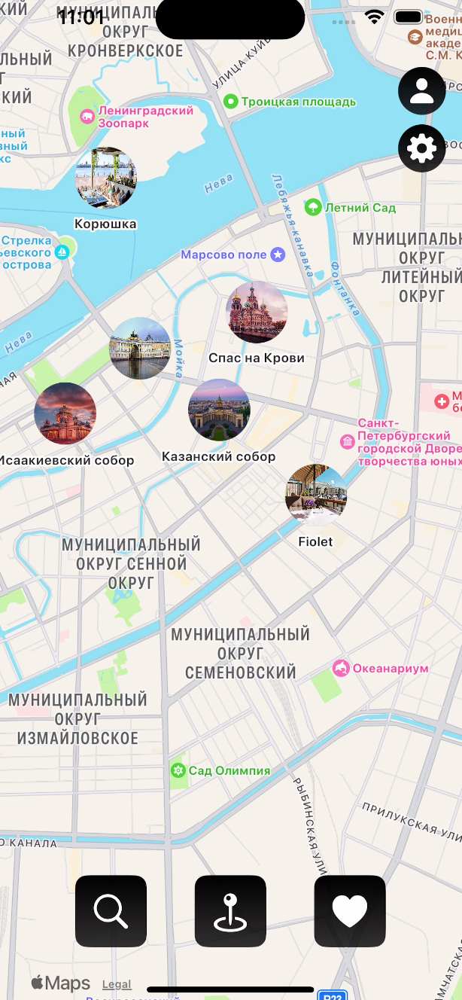
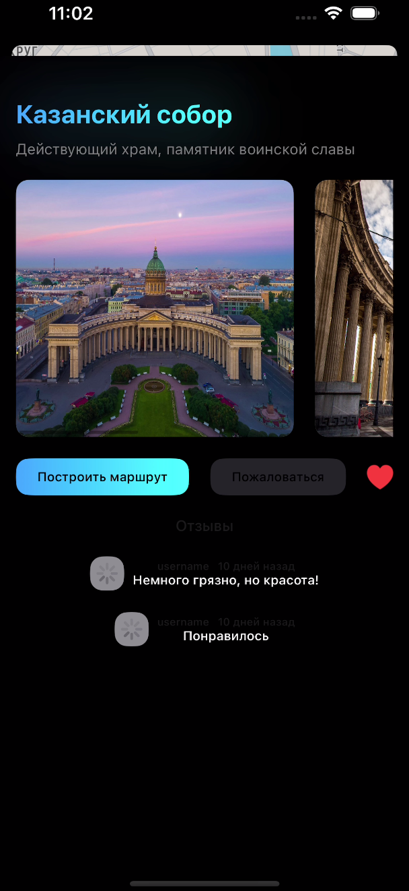
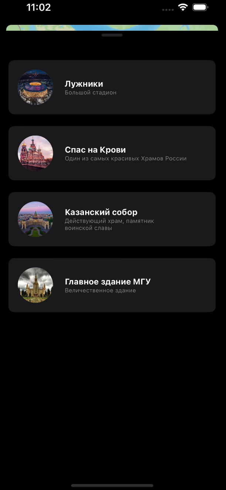
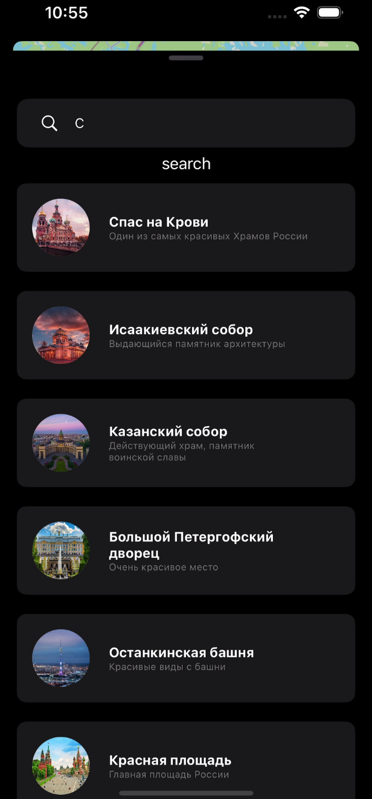

# Bubbles

**Мобильное приложение‑сервис для совместной карты достопримечательностей**

Bubbles — это клиент‑серверный проект (Android + iOS + backend), задуманный как «Zenly для достопримечательностей»: пользователи могут отмечать, просматривать и делиться интересными местами, добавлять любимые места на карту и строить маршруты до интересных локаций от других людей.

---

## Описание

Bubbles стремится стать «умным» гидом и социальной картой: помочь туристам и горожанам найти интересные места, поделиться впечатлениями и не заблудиться в новом городе. Проект выполнен командой из трёх разработчиков (Android, iOS, Backend) и ориентирован на мобильные платформы — Android и iOS.

### Что реализовано

- Просмотр списка достопримечательностей (Places)
- Просмотр деталей места с фото, описанием, рейтингом и тегами
- Поиск и фильтрация мест
- Создание/редактирование/удаление места (только для авторизованных пользователей)
- Лента активностей — отметки и действия друзей
- Карта с маркерами (клиентская часть интегрирована с картографическим SDK)
- Профиль пользователя и настройки приватности
- Базовая система аутентификации и авторизации (через Auth роуты на сервере)

---

## Технологии и стек

- **Backend**: Node.js, Express.js, JavaScript
- **ORM / ODM**: Mongoose (MongoDB)
- **Database**: MongoDB
- **Frontend** (мобильный): Kotlin (Android), Swift (iOS)

---

## Установка и запуск

### 1. Клонировать репозиторий

```bash
git clone https://github.com/sqszy/Bubbles.git
cd Bubbles
```

### 2. Запустить сервер

```bash
cd server
npm install

# скопировать .env по примеру
cp .env.example .env

npm run dev
npm run start
```

### 3. Android / IOS

- Android Открыть Bubbles/ в Android Studio и запустить на устройстве/эмуляторе.

- iOS Открыть BubblesIOS/ в Xcode и запустить на устройстве/симуляторе.

---

## Интерфейс приложения

### Главное меню

  
_Главный экран с навигацией по разделам: «Места», «Поиск», «Избранное», «Профиль» и «Настройки»._

---

### Карточка места

  
_Подробная информация о выбранном месте: описание, фото, маршрут и отзывы._

---

### Любимые места

  
_Раздел с сохранёнными пользователем локациями._

---

### Поиск и фильтрация

  
_Поиск мест по названию, описанию._
